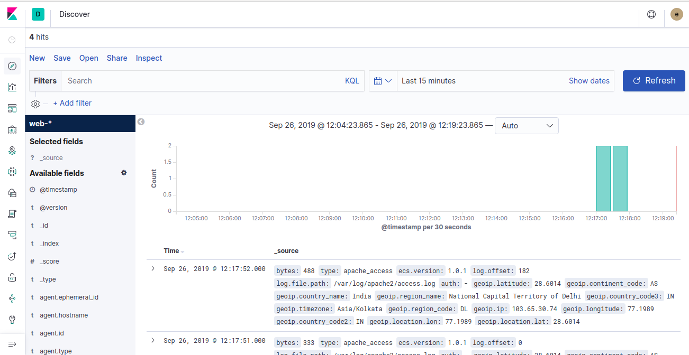
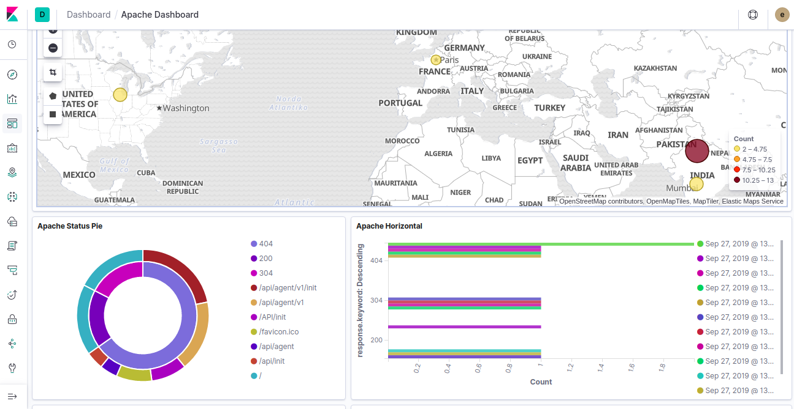
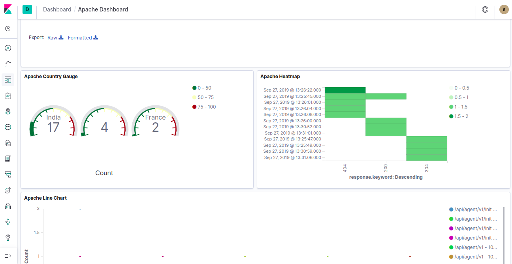
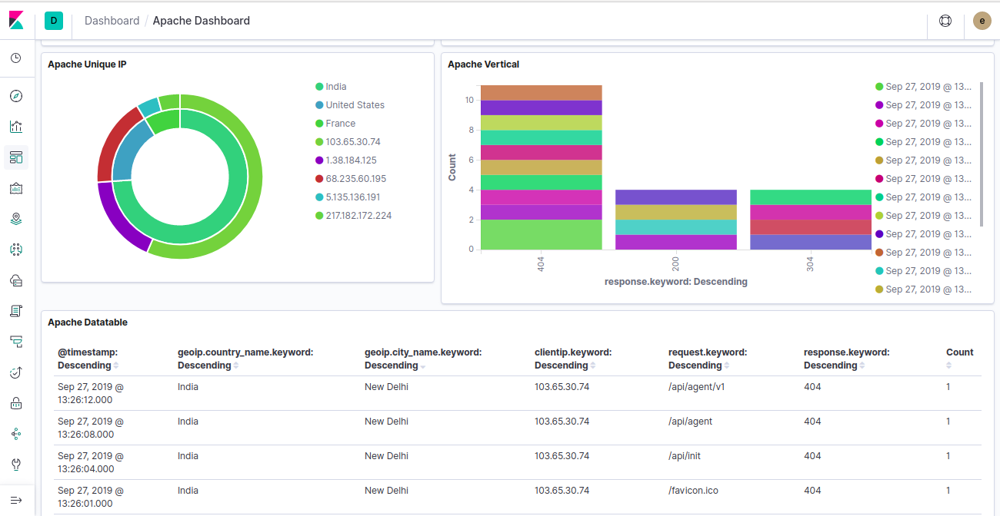

# Elasticsearch (ELK) stack on Docker

The main goal for creating this stack was to provide the environment of ELK(Elasticsearch, Logstash and Kibana) for different types of POCs. :slightly_smiling_face:

In the end result you will get a beautiful kibana dashboard like this:-



We are using the official image from Elastic:-

- **[Elasticsearch](https://github.com/elastic/elasticsearch/tree/master/distribution/docker)**
- **[Kibana](https://github.com/elastic/kibana/tree/master/src/dev/build/tasks/os_packages/docker_generator)**
- **[Logstash](https://github.com/elastic/logstash/tree/master/docker)**

This compose setup will setup these things for you:-

- [X] **Elasticsearch**
- [X] **Kibana**
- [X] **Logstash**
- [X] **Apache**

## Requirements

- **[Docker](https://docs.docker.com/install/)** version **18.X+**
- **[Docker Compose]()** version **1.12.0+**
- **[Host Machine]()** with **1.5GB** Ram

## Overview

```s
├── apache         ---> Dockerfile and confiuration file for apache
├── elasticsearch  ---> Dockerfile and configuration file for elasticsearch
├── img            ---> For storing image and screenshots
├── kibana         ---> Dockerfile and configuration file for kibana
└── logstash       ---> Dockerfile and configuration file for logstash
    └── conf.d     ---> Logstash configuration for beats, filter and outputs
```

This setup will expose these ports:-

- 9200: Elasticsearch HTTP endpoint
- 9300: Elasticsearch TCP endpoint
- 5601: Kibana UI
- 5044: Logstash beats input

## Usage

#### Set required environment variables

```shell
export ELK_VERSION=7.3.1
```

#### Building Images

```shell
docker-compose build
```

#### Bringing Up

```shell
docker-compose up -d
```

#### Clean Up

```shell
docker-compose down -v
```

After this steps, now you can go and login into kibana and visualize your logs:-

- Kibana Url:- *http://<your_ip>:5601*
- Username:- elastic
- Password:- elastic

## To Do
- [ ] Add some dashboards for Apache
- [ ] Create a canvas for logs

## Kibana Dashboards

You can import the kibana dashboard as well which is [here](./kibana/dashboards/apache.ndjson)

Here are some awesome screenshots you will get after importing the dashboard.





